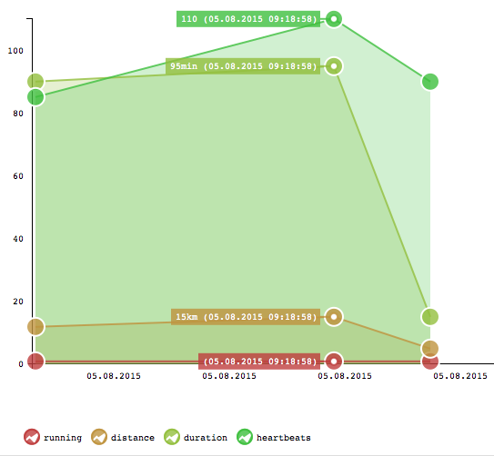

open life tracker
=================
Track any personal or professional data in the browser. Track your health, the fuel usage or just use it as a diary with some spice. The graphs visualizes the data. It's offline only and uses localStorage. 

`#`Hashtags with `:values` enable you to track your progress or events on any topic in the chart: 

    Good running session #running #distance:12km  #duration:90min #heartbeats:85
    
    Doctor says it's a cold #sick #fever:37  

    Lasagne for lunch #food #calories:560 #carbohydrates:250g

Try the [Demo Application](https://synox.github.io/open-life-tracker/app/)
## Installation
1. Copy the `app` directory to your webspace. 
2. Make sure the file offline.appcache is served with mime-type `text/cache-manifest`. There is a `.htaccess` file for apache.
3. Access with a modern mobile or desktop browser. 

## Status
This software is still under development. Be safe and export your entries every few weeks or month. 

## Build and test
If you make changes, that's how you build it. [npm](https://nodejs.org/download/) installation required.

    npm install
    npm test
    ./build

## Features
- Hashtags with values using `:` or `=` example: `#distance:15km #coolness=55`
- Chart with zooming (thanks to https://github.com/n3-charts/line-chart/)
- Responsive design, mobile first
- Local storage, not sync
- Import/Export with json or base64

To do: 
- more unit tests
- test with large number of entries
  
## Used JS libraries
Base:
 * http://angularjs.org/
 * http://getbootstrap.com/
 * http://jquery.com/
 
Data handling:
 * https://github.com/lodash/lodash

Charts:
 * https://github.com/n3-charts/line-chart
 * http://d3js.org/

# License

GPLv3